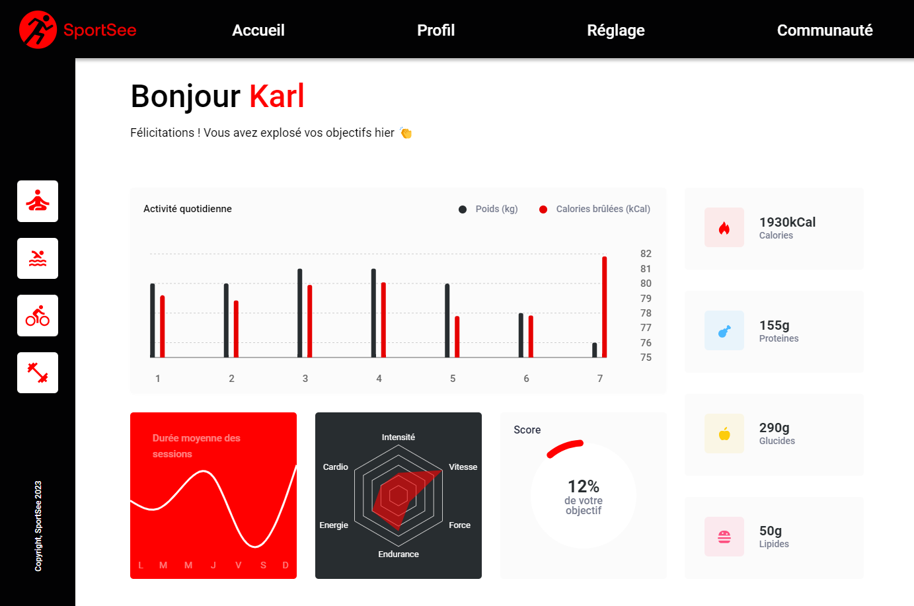
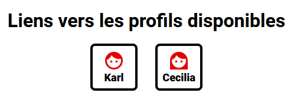

# SportSee

This is project #12 of the OpenClassrooms 'Frontend Developer JS/React' path. 
The SportSee user profile page is a sports analytics dashboard that allows users to track various types of data, such as workout sessions completed and calories burned. 
The dashboard is made up of various charts and visuals created mostly with the [**Recharts**](https://recharts.org/en-US/) library. 

## Prerequisites

- Node.js (v18.13.0 was used for this project)
- Git
- Clone the repository for the API available at this URL: https://github.com/OpenClassrooms-Student-Center/P9-front-end-dashboard

**Note**: This project uses TypeScript (v4.9.5). TypeScript is included as a dependency in the package.json file, and will be installed automatically when running npm install.

## Installation

1. Clone the repository.
2. Open the project in your terminal and run the command `npm install`.
3. Create a `.env` file at the root of the project.
4. Define the API variable in the `.env` file with the following syntax: `REACT_APP_API_URL=http://localhost:3000` (Change PORT if needed).
5. Start the project with the command `npm run start`.
6. Once you start the project with npm run start, your default browser will launch, and you can select a data source (MOCK or API) and navigate to one of the two available profiles to view the dashboard page.

  
   

### API Usage

To use the API, it is necessary to have cloned the API repository mentioned in the Prerequisites and to have started it locally (refer to the [API README](https://github.com/OpenClassrooms-Student-Center/P9-front-end-dashboard/blob/master/README.md)). 

## Data Source

The home page allows you to select a data source to test this new profile page. You can select MOCK or API. If you select Mock, the data will come from a JSON file in the project. If you select API, calls will be made to retrieve the data from the API whose URL is defined in the `.env` file. The library for API calls is **Axios**.

## Available Profiles

Only the data of two profiles with identifiers 12 and 18 are available. To access the dashboard page for a specific profile, you can navigate to the URL path /profile/<profile_id>.
